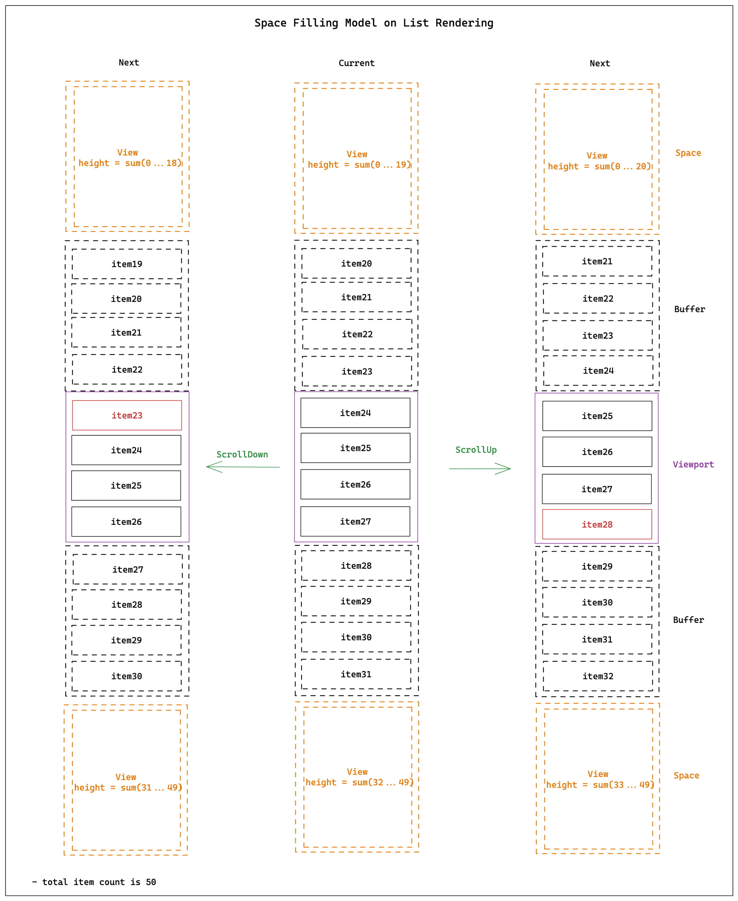
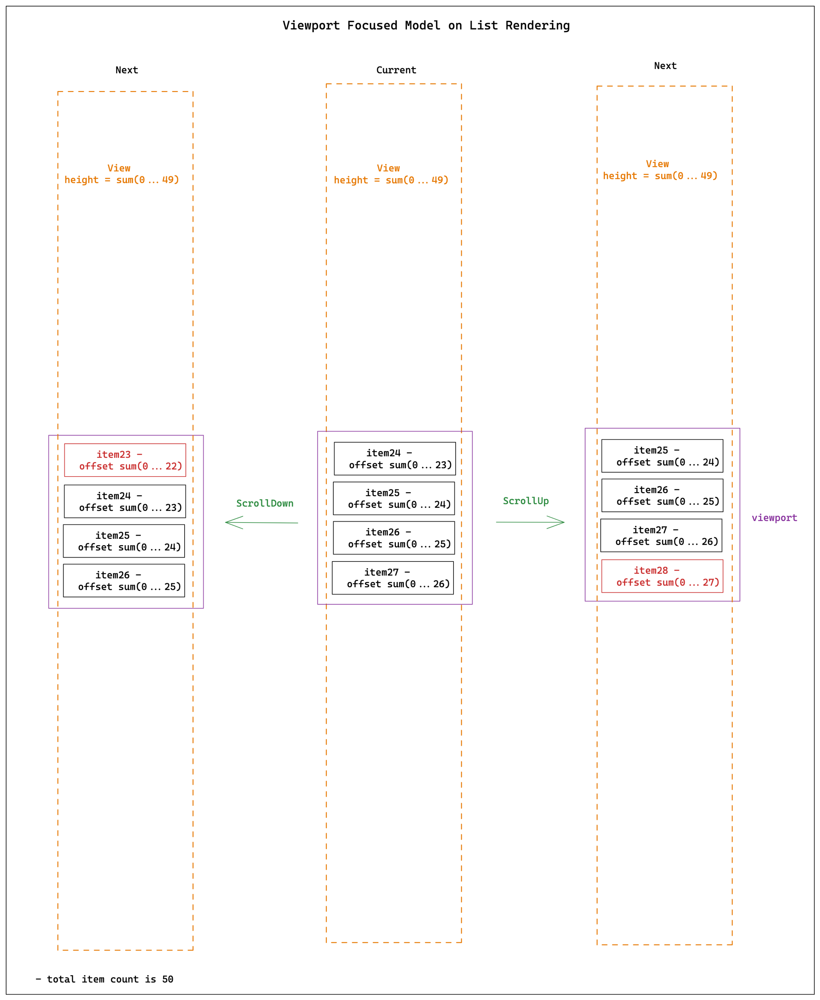
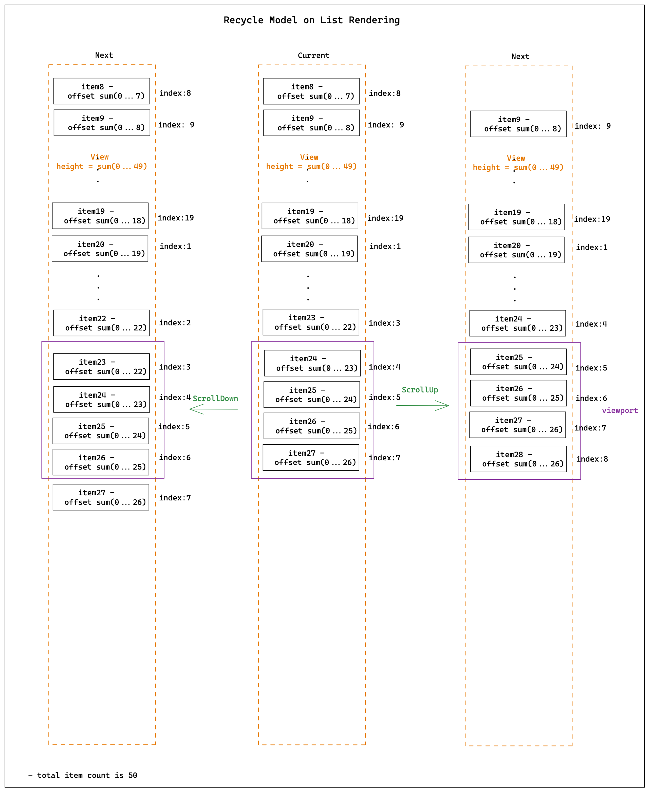

# Rethinking List
在进行移动端开发时，List永远是逃不开的话题；尤其是针对电商和社区这种泛内容推荐和展示的业务形态，尽可能快的展示页面信息，同时在滑动过程中能够维持高帧率流畅度会直接影响到用户的使用体感。大部分的业务诉求都可以抽象成尽可能的展示Block（功能模块），而大量近似相同的Block其实在技术层面被定义为List。所以，就单纯的页面应用而言，可以划分为Block和List；其中Block是一个任意的结构体比如一个价格条，一个促销条等，而List是通过相同的render function渲染得到的一堆结构体，比如feeds。List概念会在此部分进行解答；而针对应用的抽象，Block和List应该如何进行合理的拼接会在https://doc.weixin.qq.com/doc/w3_ALkA6QbFAO07TbP8I8nSC6eBxUp82?scode=ANAAyQcbAAg5gW3tlCALkA6QbFAO0 进行阐述
动机
举一个最简单的渲染多个相同结构体的例子；它是一个没有任何渲染优化处理的code snippet，如果实际运行下来的话，会有两个问题的存在
- 首屏慢
- 滑动过程中会卡顿
```ts
import React, { useState } from 'react'
import { ScrollView } from 'react-native'

const Feeds = props => {
  const [data] = useState(Array.from({ length: 10000 }, (_, i) => i + 1))

  return (
    <ScrollView>
      {data.map((item, index) => <Item item={item} index={index} />)}
    </ScrollView>
  )
}
```

## 首屏慢
主要是第一次存在大量数据的加载或处理，就会造成JS的阻塞；比较通用的方案就是batch update，一次推送最多比如10个数据进行渲染；
### 滑动卡顿
从字面意思来解释数据模型的抽象
- 滑动：当有元素在视窗外，试图去【看】 它也就有了滑动；【元素】其实就是一个Block，结构相同（render function一样）的Block聚合成了List；接下来会在数据模型上抽象为 Item Model
- 卡顿：当滑动过程中出现了丢帧（1s是60帧），正常人眼会对1s 55帧开始有不连贯的感觉；之所以造成【卡顿】可以认为是滑动过程中，你看到了不应该看到的内容（即渲染没有跟上你的滑动速率），这里将开源社区的方案抽象为 Rendering Model

#### Item Model
这里主要是通过item的布局维度进行应用中存在的Block类别进行划分；
#### Static Layout
当渲染item之前已经知道了item的layout；它比较常见于商品双列，单列；以React Native FlatList为例，它对应的是提供了getItemLayout 方法的List
```ts
import React from 'react'
import { FlatList, ScrollView, View, Text } from 'react-native'

const renderItem = ({ item  }) => <View style={{ height: 100 }}><Text>{item}</Text></View>

const Feeds = props => {
  const [data] = useState(Array.from({length: 10000}, (_, i) => i + 1))
  const getItemLayout = useCallback((data, index) => ({ length: 100, offset: index * 100, index }))

  return (
    <ScrollView>
      <List
        data={data}
        renderItem={renderItem}
        getItemLayout={getItemLayout}
      />
    </ScrollView>
  )
}
```

### pros
- 事先拿到item的布局，可以快速进行计算滚动到某一个位置下应该展示的item
- 在batch update追加元素时，能够较少不必要的元素渲染。	因为batchUpdate是在不知道元素整体高度时，默认渲染约定的元素。
### cons
- 局限性，毕竟能够事先给出item高度的场景不多；很多卡片，会因为某一个icon的大小发生length的改变
- 不能够使用在item会动态改变的情况，比如一个卡片中某一个元素状态改变引起了item的布局改变
## Runtime Layout
只有当item渲染完毕才能够知道它对应的layout；它是和Static Layout相对，描述的是只有当组件渲染以后才能知道元素的layout
### pros
- 灵活性，不需要在数据源侧增加宽高属性，可以允许item任意高度也是目前移动端最常见的场景
- 可以泛化为页面上任何的一个block区域
### cons
- 如果要计算滑动到某一个位置时，哪些元素在视窗；需要事先渲染出item，存储对应的layout，再进行计算
- 在进行batchUpdate时存在一定的渲染浪费
## Rendering model
当存在大量DOM节点时，无论是浏览器还是容器都会占用大量的内存；同时比如资源的下载比如图片还有decode操作，所有的操作都是一个比较耗时的行为。不进行策略优化的话，滑动会是一个非常卡顿的表现；开源社区目前有两种解决方式：
- 方案一（Space Filling）：感知视窗，上下预留buffer item；滑动过程中，buffer外的item被替换成空Div/View；过程中会存在大量的buffer外item unmount和进入buffer item的mount
- 感知视窗，上下预留buffer item；列表固定个数DOM结构
  - 方案二（Viewport Focused）：滑动过程中，只渲染进入视窗部分的元素；
  - 方案三（Recycle）：滑动过程中，策略上离视窗最远的节点在数据层替换为将要进入视窗的item
## Space Filling

## Viewport Focused

- [GitHub - bvaughn/react-window: React components for efficiently rendering large lists and tabular data](https://github.com/bvaughn/react-window)

## Recycle



目的
提供一套可维护，可拓展，可配置，全场域的跨平台列表解决方案
- 可维护：
  - 单测率覆盖
  - 函数式底层设计原则，确保核心逻辑reducer & middleware 可回溯，可测试；尽量消除逻辑层的副作用
- 可扩展：
  - model和UI完全解藕，model提供插件能力（规划中）
  - List数据结构提供abstract class，提供自定义实现List Model instance（规划中）
- 可配置：
  - 初始化个数，batch更新数量，视窗大小，buffer高度控制 都可以通过参数进行配置
  - 提供多种item加载和释放策略，都可以通过参数控制
- 全场域：
  - 支持单列表，嵌套列表的基础能力，并且提供API可供业务侧进行列表组合的二次开发（比如MasonryList，Dnd等）
- 跨平台：
  - 数据处理，加载和释放都被收归到List Data Model进行约束，提供不同的框架update逻辑就可以对应技术栈下的优化

## Roadmap
按照预定的List Data Model作为项目的最终结果输出，任务进行下面各维度拆解
- List Data Structure：提供数据层的抽象，比如从
- Reducer / Middleware：
  - 【DONE】Space Model Rendering落地
  - 【3-4月】Recycle Model Rendering落地
- State：提供对外的接入的API
  - 【DONE】完成Space Model Rendering下的结果输出
  - 【3-4月】完成Recycle Model Rendering 下的结果输出
### 详细设计
#### ScrollMetrics
ScrollMetrics是驱动视窗进行计算的原动力，它是对滚动模型的抽象，主要包含下面几个属性
```ts
export type ScrollMetrics = {
  contentLength: number;
  offset: number;
  visibleLength: number | undefined;
  dOffset: number;
  dt: number;
  timestamp: number;
  velocity: number;
};
```

- contentLength：整个内容的高度，主要是用来进行是否触底的逻辑判断，
- offset：滚动的高度，只有当offset发生了变化才有引起视窗内内容的变化
- visibleLength：视窗的高度，当计算元素是否在视窗中时需要作为参照值
- dOffset：在垂直或者方向上的前后两次scroll event造成的距离差
- dt：触发前后两次scroll event的时间差
- timestamp：scroll event发生时的时间
- velocity：速率，目前只要是协助reducer进行策略处理时判断向上或向下滚动的依据。
#### List Data Structure
List Data Struture是针对item layout的抽象，收集item的width和height信息；首先先理解的是，在整个操作List的过程中，存在两个非常核心的概念：
- key：是item的唯一标识，不能够存在重复，这个也是进行item meta信息查找过程中最核心的依赖；原则上，如果说item key没有变化的话，整体的布局是不太会发生变化（除了item渲染层面存在动态因素）；同时key也是目前framework在list渲染时进行优化的重要抓手。所以，在data model层面keyExtractor或者indexKeys，其中一个必传。
- index：表示item渲染到的位置；在目前的结构设计中，index会被设计成通过itemMeta进行获取的方式；因为假如说list data存在了remove/insert的话，index作为props进行传递会造成大量的渲染损耗，所以在data model层面提供了函数的方式进行获取对应的indexInfo
```ts
ListDimensions
class ListDimensions<ItemT> {
  data: Array<ItemT>;
  keyExtractor: KeyExtractor<ItemT>;
  getItemLayout?: GetItemLayout<ItemT>;
  getItemSeparatorLength?: GetItemSeparatorLength<ItemT>;
}
```

- data：数据源，当list中值发生变化时data需要被及时更新
- keyExtractor：生成item key；正如前面所述，keyExtractor是ListDimensions模型下非常核心的概念；它是item在模型下的标识符，通过它映射出ItemMeta，可以实现对item的任何布局以及其它附加属性的查询。
- getItemLayout：optional，返回item的length；在ListDimensions进行item的offset计算时，是基于IntervalTree 来实现；只需要知道item的length，就可以快速得到它到List顶部的距离；这个也是针对上面Item Model的抽象，如果说当前属性被提供了，那么我们就可以在元素渲染之前知道它的布局，从而在渲染层面有很大的提升，但是这个终究是太理想化；所以在ListDimensions提供了setItemLayout的方法来动态更新item的布局信息。
- getItemSeparatorLength：optional，这个是参考目前List在进行渲染时的结构模型进行抽象；比如正常情况下，List都是有Item组成的，但是item之间可能存在比如margin这种布局信息，而这种信息会被统一抽象成SeparatorComponent，而SeparatorComponent对应的布局高度就是通过这个函数来返回。同时注意它表示的是两个item之间的length，如果说是最后一个item的话，它是不存在SeparatorLength这个信息的
#### Reducer

##### 为什么要有reducer的概念？
reducer等同于redux中的概念。当一个系统开始复杂，就会存在对于不同条件下执行不同逻辑的情况，而reducer其实就是为了这个场景，因为reducer概念层会有对应不同的action，而action可以将复杂系统的指令变成可描述，而不是冰冷的if语句之类的处理；从而在逻辑书写上，做到清晰和可控

##### middleware存在的价值
middleware是在reducer中使用到的底层逻辑处理思想，借鉴于express；同样的问题，当系统复杂以后，如何将逻辑处理做好功能分割同时实现复用是实现后续维护性的重要考量因素。目前系统中简易的middleware机制，可以实现很好的实现功能可拆卸和拼装，达到易维护的目的。

##### 目前都有什么action，分别对应什么样的功能划分；对后续action的规划是什么
当存在reducer的概念时，相对应的就会有action，继而会有actionType。目前在进行滑动处理的策略上还比较简单，共有四种模型
- hydrationWithBatchUpdate：解决当存在大量数据时，提供组件层分页加载的能力；
- scrollDown：当向下滚动时，视窗中应该展示的index信息
- scrollUp：当向上滚动时，视窗中应该展示的index信息
- recalculate：重新计算某一scrollMetrics下，视窗中应该展示的index信息
现在对action的拆解和划分比较简单，比如scrollDown和scrollUp就是通过velocity的方式进行判断处理，然后提供某些index需要进行视窗，某些需要进入buffer的信息。整体在智能处理上是比较弱的，所以后续会考虑比如在向下滑动时动态的调整上下内容的buffer，从而在渲染层面提供更好的体感

##### 设计模式的思考
整体的设计是为了让state producer功能模块更独立，更易扩展和维护；

#### State
